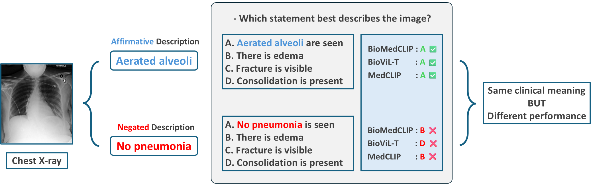

# NAST
# NAST: Negation-Aware Selective Training for Medical Vision–Language Models

Official repository for:

> **NAST: Negation-Aware Selective Training for Medical Vision–Language Models**  
> (ICML submission)

This repository provides:

- ✅ Construction code for the **polarity-controlled diagnostic benchmark**
- ✅ Construction code for the **contextual clinical negation dataset**
- ✅ Causal tracing (CTE) implementation for CLIP-based models
- ✅ Evaluation pipelines for retrieval and claim-ranking tasks

---

## 🔍 Overview

Medical vision–language models (VLMs) exhibit systematic difficulty in interpreting negation (e.g., *“no pneumothorax”*).  
This repository supports reproducible evaluation and analysis of negation sensitivity in medical VLMs.

The project includes:

- A **polarity-controlled diagnostic benchmark** (negated vs affirmative-equivalent MCQs)
- A **contextual negation benchmark** for retrieval and claim-based evaluation
- A **causal tracing framework** for estimating layer-wise negation contribution (CTE)

⚠️ This repository does **not** distribute MIMIC-CXR images or raw reports.  
You must obtain access through the official MIMIC-CXR process.

---

## 📂 Repository Structure

<pre>
nast-negation-medvlm/
│
├── README.md
├── LICENSE
├── requirements.txt
├── pyproject.toml
│
├── src/
│   └── nast/
│       ├── __init__.py
│       │
│       ├── evaluation/
│       ├── causal_tracing/
│       ├── models/
│       └── utils/
│
├── scripts/
│   ├── build_eval_benchmark.py
│   ├── build_contextual_dataset.py
│   ├── validate_jsonl.py
│   └── make_splits_patient_level.py
│
├── data/
│   ├── benchmarks/
│   │   ├── mednega_cxr_eval/
│   │   └── contextual_negation/
│   └── mappings/
│
├── docs/
│   ├── benchmark.md
│   ├── data_card.md
│   └── causal_tracing.md
│
└── private/ 
  </pre>

